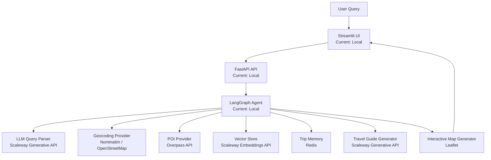

# AI Travel Agent (LangGraph + Scaleway)

An AI-powered travel planning agent capable of generating customized trip itineraries using LLM reasoning, geospatial data, and interactive maps.

The system combines:

- LangGraph agents
- Scaleway Generative APIs (LLM + Embeddings)
- OpenStreetMap POI search
- Redis memory
- Streamlit UI
- FastAPI backend

This project demonstrates how to build a **production-style AI agent architecture** capable of planning trips dynamically based on user intent.

Example query:
```
Plan a 2-day romantic trip in Paris with museums and wine bars
```

---

# Architecture

The system is designed as a modular AI agent architecture.

Components include:

- UI
- API
- Agent orchestration
- Tool providers
- Memory
- Vector search
- LLM

## Current Architecture



## Component Hosting (Current)
Component	Technology	Hosting
UI	Streamlit	Local
API	FastAPI	Local
Agent	LangGraph	Local
LLM	Scaleway Generative API	Scaleway
Embeddings	Scaleway Embeddings API	Scaleway
POI search	OpenStreetMap Overpass API	External
Geocoding	Nominatim	External
Memory	Redis	Local (optional Scaleway Managed Redis)
Map rendering	Leaflet	Browser

## Example Query Flow
Example Query Flow
Plan a 2-day romantic trip in Paris with museums and wine bars
Execution flow:

1. UI sends query to FastAPI
2. Agent parses intent (city, duration, interests)
3. Geocoder finds city coordinates
4. POI provider retrieves attractions and restaurants
5. Agent builds itinerary
6. Vector search retrieves knowledge (RAG)
7. Scaleway LLM generates travel guide
8. Map generator renders an interactive map
9. UI displays itinerary and map

Features
AI Trip Planning
The agent generates itineraries based on:
duration
travel style
interests
location
Example prompts:
Plan a 1-day food trip in Rome
Plan a 2-day romantic trip in Paris
Plan a museum weekend in Madrid
Plan a chill trip in Barcelona

Dynamic POI Discovery

Attractions and restaurants are discovered dynamically using OpenStreetMap.
Supported places include:
museums
historical sites
parks
restaurants
cafes
bakeries
wine bars
nightlife venues

RAG Knowledge Integration

The agent retrieves additional contextual knowledge using vector search.
Example knowledge files:
knowledge/paris.txt
knowledge/rome.txt
knowledge/barcelona.txt
Embeddings are generated using Scaleway Embeddings API.

Interactive Map Generation

Each itinerary includes a generated map showing:
attractions
restaurants
itinerary points
Maps are rendered with Leaflet.

Trip Memory

Trips can optionally be stored in Redis.
Example:
save_trip("paris", itinerary)
load_trip("paris")
This enables conversational improvements later.

Local Setup

Clone the repository:
git clone https://github.com/JWangSCW/personal_assistant.git
cd personal_assistant

Create virtual environment:
python -m venv venv
source venv/bin/activate

Install dependencies:
pip install -r requirements.txt

Environment Variables
Create .env:
SCW_SECRET_KEY=your_scaleway_secret_key
SCW_MODEL=llama-3.1-8b-instruct
SCW_EMBEDDING_MODEL=bge-multilingual-gemma2

REDIS_HOST=
REDIS_PORT=6379
REDIS_PASSWORD=
REDIS_DB=0

Redis is optional.
If not configured, memory features will be disabled automatically.

Scaleway Deployment (Target Architecture)
This demo can be deployed entirely on Scaleway.
flowchart TD

    USER[Internet User]

    USER --> LB[Scaleway Load Balancer]

    LB --> K8S[Kubernetes Kapsule]

    K8S --> API[Travel Agent API]

    K8S --> UI[Streamlit UI]

    API --> REDIS[Managed Redis]

    API --> GENAI[Scaleway Generative API]

    API --> OBJ[Object Storage]


Future Improvements

Planned improvements:

route optimization

weather-aware trip planning

budget estimation

conversational itinerary editing

persistent vector database

Kubernetes deployment automation