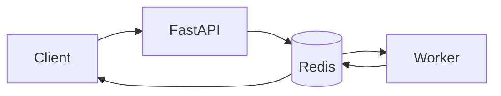

# AI Travel Planner

Async AI agent system for travel planning, deployed on Scaleway.

---

## What it does

* Generate a day-by-day travel itinerary (LLM)
* Enrich locations with POIs (Overpass API)
* Add weather context (Open-Meteo)
* Render an interactive map (Folium)
* Support incremental refinement ("make it more romantic", etc.)

Outputs:

* structured itinerary
* interactive map
* optional travel guide

---

## Overview

System built around **async job execution** and **agent orchestration**.

Core components:

* FastAPI (API layer)
* Redis (state + queue)
* Worker (execution runtime)
* Scaleway Generative APIs (LLM)
* Streamlit (UI)

Frontend never blocks. Requests are processed asynchronously.

---

## Execution Model



Flow:

1. Client submits request
2. API creates job_id
3. Job stored in Redis
4. Worker executes pipeline
5. Result stored in Redis
6. Client polls status

---

## Agent Pipeline

```
parse (intent extraction)
→ plan (LLM itinerary)
→ enrich (POI + geo)
→ map (render)
→ guide (optional)
```

Notes:

* LLM used for planning only
* enrichment handled outside LLM
* pipeline partially deterministic

---

## Job Model

States:

```
pending → running → completed | failed
```

Redis layout:

```
job:{job_id}:meta
job:{job_id}:steps
job:{job_id}:result
```

---

## Worker

Runs as a Kapsule deployment.

Main loop:

```
fetch job
set status = running
execute steps
store result
set status = completed
```

Responsibilities:

* orchestration
* step tracking
* error handling

---

## Step Model

```json
{
  "id": "itinerary_llm",
  "status": "done",
  "duration_s": 1.2,
  "service": "scaleway_genai"
}
```

Used for:

* UI visualization
* latency analysis
* debugging

---

## LLM Integration

Provider: Scaleway Generative APIs

Design rules:

* short prompts
* limited context
* structured output

Example constraints:

```
max 4 places / day
short descriptions
```

---

## External Integrations

* Open-Meteo (geocoding + weather)
* Overpass API (POI discovery)
* Wikipedia (context)

Failure handling:

* partial results allowed
* non-critical steps do not fail job

---

## Observability

* step status
* step duration
* execution timeline (UI)

---

## Quick Demo

Run locally:

```bash
# API
uvicorn app.main:app --reload

# Worker
python worker.py

# UI
streamlit run ui/app.py
```

## Access

Local development:

* UI: [http://localhost:8501](http://localhost:8501)

Deployed environment (Scaleway Load Balancer):

* UI: https://<load-balancer-endpoint>

Example query:

```text
Plan a 2-day food trip in Paris
```

Plan a 2-day food trip in Paris

````

---

## Deployment

```mermaid
flowchart TD

    LB[Load Balancer]

    LB --> UI[Streamlit Pod]
    LB --> API[FastAPI Pod]

    API --> Redis[(Managed Redis)]
    Redis --> Worker[Worker Pod]

    Worker --> GenAI[Scaleway Generative API]
    Worker --> External[External APIs]
````

---

## Scaleway Services

* Kapsule (Kubernetes)
* Managed Redis
* Generative APIs
* Container Registry

---

## Limitations

* single worker
* Redis used as queue
* no retry / DLQ

---

## Trade-offs

* Redis as queue (simple, limited scaling)
* polling instead of push (simpler frontend)
* single worker (no horizontal scaling yet)

---

## Roadmap

* introduce Scaleway Queues
* multi-worker scaling
* caching (POI / geocode)

---

## Notes

Stateful async agent system.

LLM handles planning.
Backend handles orchestration and state.
