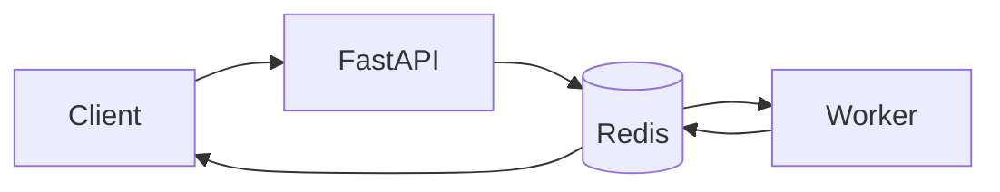
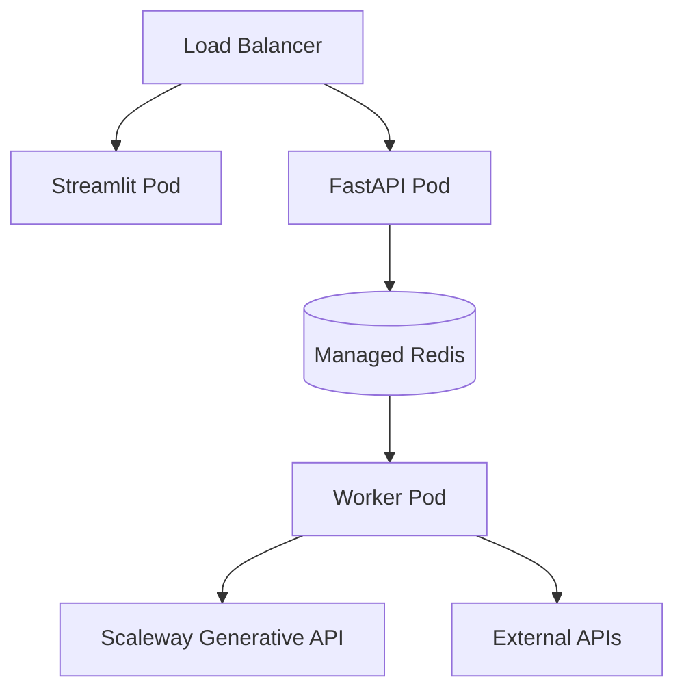

# AI Travel Planner

Async AI agent system for travel planning, deployed on Scaleway.

---

## What it does

Given a natural language request:

```text
Plan a 2-day food trip in Paris
```

The system:

- parses intent (destination, duration, preferences)
- generates a structured itinerary (LLM)
- enriches places with coordinates (geocoding)
- renders an interactive map
- optionally generates a travel guide

Outputs:
- day-by-day itinerary
- map (Folium)
- optional narrative guide

---

## Overview

System built as an **async agent pipeline**.

Core components:
- FastAPI (job submission + polling)
- Redis (state + queue)
- Worker (execution runtime)
- Scaleway Generative APIs (LLM)
- Streamlit (UI)

Execution is non-blocking:
- API returns immediately
- UI polls job status

---

## Execution Model



Flow:

1. client submits request  
2. API creates job_id  
3. job stored in Redis  
4. worker executes pipeline  
5. result stored in Redis  
6. client polls status  

---

## Agent Pipeline

```
parse → plan → enrich → map → guide
```

Details:

- **parse**  
  extract structured intent (city, days, preferences)

- **plan**  
  generate itinerary (LLM)

- **enrich**  
  geocode + attach coordinates

- **map**  
  generate Folium map

- **guide (optional)**  
  generate textual recommendations

Notes:

- LLM only used for planning  
- enrichment handled outside LLM  
- pipeline partially deterministic  

---

## Job Model

States:

```
pending → running → completed | failed
```

Redis layout:

```
job:{job_id}:meta
job:{job_id}:steps
job:{job_id}:result
```

---

## Worker

Runs as a Kapsule deployment.

Main loop:

```
fetch job
set status = running
execute pipeline
store result
set status = completed
```

Responsibilities:

- orchestration  
- step tracking  
- error handling  

---

## Step Model

Each step:

```json
{
  "id": "itinerary_llm",
  "status": "done",
  "duration_s": 1.2,
  "service": "scaleway_genai"
}
```

Used for:

- UI (architecture view)  
- Gantt timeline  
- latency analysis  

---

## LLM Integration

Provider: Scaleway Generative APIs

Design rules:

- short prompts  
- limited context  
- structured output  

Example constraints:

```
max 4 places / day
short descriptions
```

---

## External APIs

- Open-Meteo (geocoding + weather)  
- Overpass API (POI discovery)  
- Wikipedia (context)  

Failure handling:

- partial results allowed  
- non-critical steps do not fail job  

---

## Observability

Available in UI:

- step status  
- step duration  
- execution timeline (Gantt)  
- architecture view (live)  

---

## Quick Demo

Run locally:

```bash
# API
uvicorn app.main:app --reload

# Worker
python worker.py

# UI
streamlit run ui/app.py
```

---

## Access

Local:
- http://localhost:8501

Deployed (Scaleway Load Balancer):
- https://<load-balancer-endpoint>

---

## Deployment



---

## Scaleway Services

- Kapsule (Kubernetes)  
- Managed Redis  
- Generative APIs  
- Container Registry  

---

## Limitations

- single worker  
- Redis used as queue  
- no retry / DLQ  

---

## Trade-offs

- Redis as queue (simple, limited scaling)  
- polling instead of push (simpler frontend)  
- single worker (no horizontal scaling yet)  

---

## Roadmap

- introduce Scaleway Queues  
- multi-worker scaling  
- caching (POI / geocode)  

---

## Notes

Stateful async agent system.

LLM handles planning.  
Backend handles orchestration and state.
